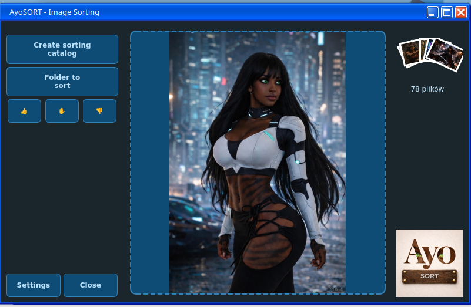
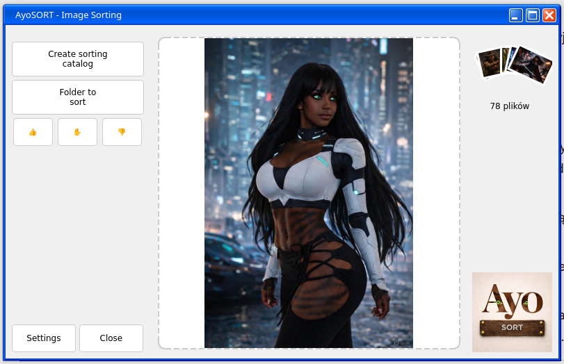
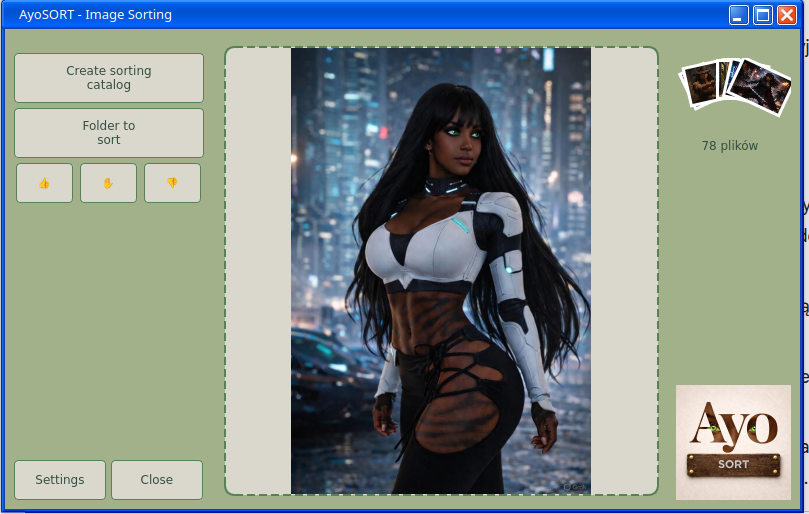
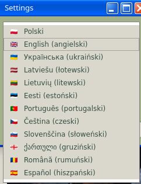

# AyoSORT 1.0.0 - Intelligent Image Sorting


**AyoSORT** is a tool created out of a passion for order and technology. The application allows for fast and intuitive categorization of image files, offering a modern graphical interface built using Python and Qt.

## 📸 Program Preview
| [Creative Theme](screenshots/main_window_creative.png) | [Light Theme](screenshots/main_window_light.png) | [Relax Theme](screenshots/main_window_relax.png) |
|:---:|:---:|:---:|
| [](screenshots/main_window_creative.png) | [](screenshots/main_window_light.png) | [](screenshots/main_window_relax.png) |

### 🌐 Wide Language Selection
Manage your photos in one of the many available languages:
[](screenshots/language_selection.png)

## 🚀 Features
* **Intuitive Management**: Quickly create sorting directories directly from the application.
* **Multi-language Support**: Full support for various alphabets and regions.
* **Personalization**: Support for advanced QSS themes (Light, Creative, Relax).
* **User-Friendly Interface**: Minimalist design optimized for user experience (UX).

## 🌐 Supported Languages
AyoSORT displays language names in their native alphabets for easier navigation:

* 🇵🇱 **Polski** (Polish)
* 🇬🇧 **English**
* 🇺🇦 **Українська** (Ukrainian)
* 🇱🇻 **Latviešu** (Latvian)
* 🇱🇹 **Lietuvių** (Lithuanian)
* 🇪🇪 **Eesti** (Estonian)
* 🇵🇹 **Português** (Portuguese)
* 🇨🇿 **Čeština** (Czech)
* 🇸🇮 **Slovenščina** (Slovenian)
* 🇬🇪 **ქართული** (Georgian)
* 🇷🇴 **Română** (Romanian)
* 🇪🇸 **Español** (Spanish)

## 🛠️ Technology
The application is designed for performance and seamless integration with the desktop environment:
* **Language**: Python (the author's preferred language).
* **GUI**: PyQt / PySide (utilizing QSS stylesheets for full visual control).
* **Environment**: Developed on **Fedora** with **KDE Plasma** using **ASUS TUF Gaming** hardware.

## 📦 Ayo Ecosystem
AyoSORT is part of a broader family of tools supporting daily workflows:
* **[Ayo-UP](https://github.com/Klucznik26/Ayo-UP)**: A dedicated tool for efficient file uploading and updates.
* **[AyoCONVERT](https://github.com/Klucznik26/AyoCONVERT)**: A convenient file converter focusing on data quality.
* **[AyoARCH](https://github.com/Klucznik26/AyoARCH)**: A solution for secure and organized resource archiving.

Full information about the projects can be found on the official website: **[AyoWWW](https://klucznik26.github.io/AyoWWW/)**.

## 📥 Installation
1. Clone the repository:
   ```bash
   git clone [https://github.com/Klucznik26/AyoSORT.git](https://github.com/Klucznik26/AyoSORT.git)
