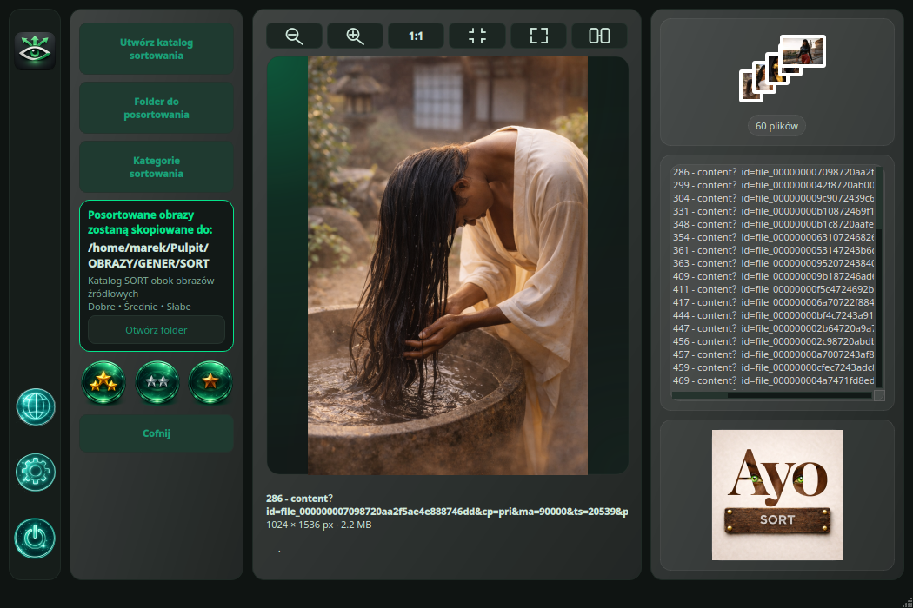
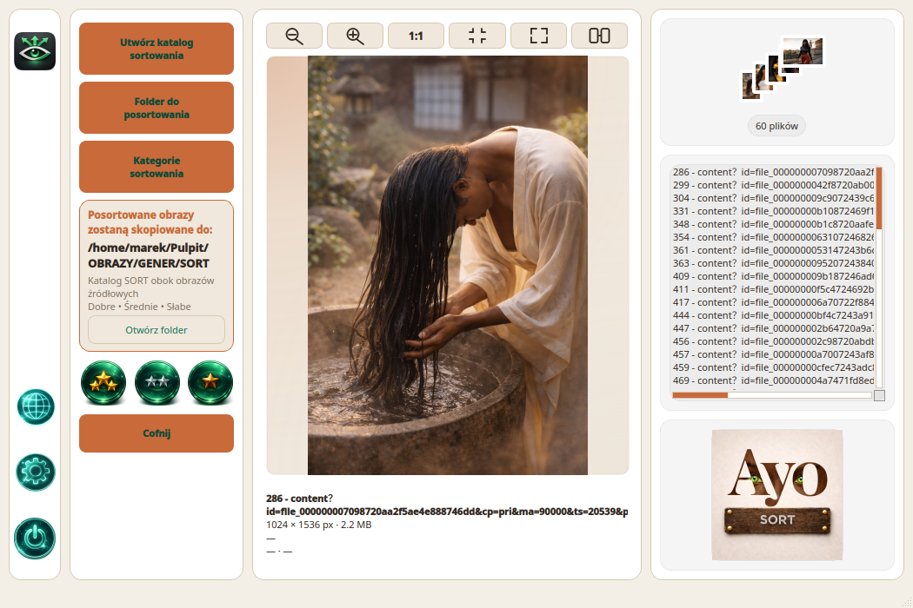
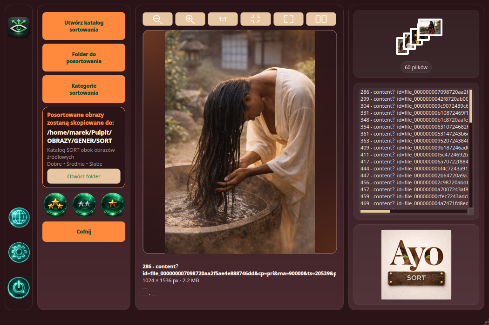
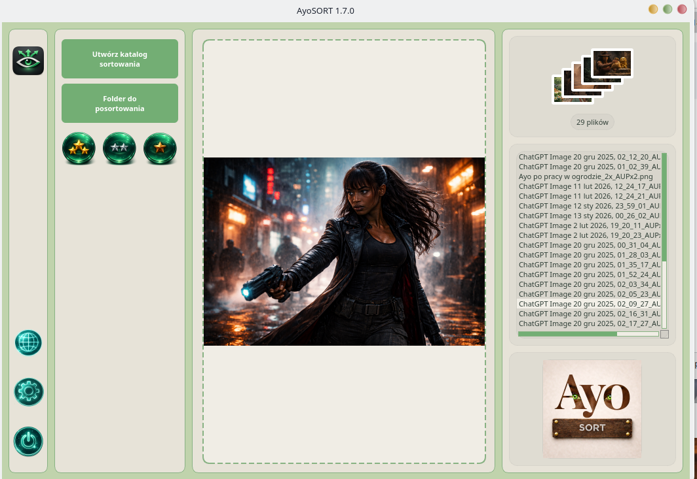
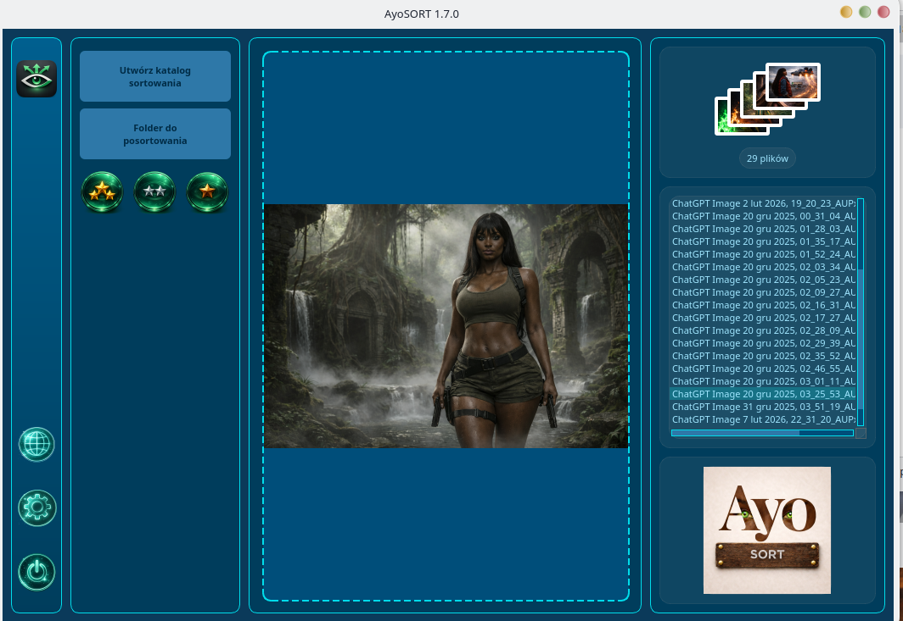
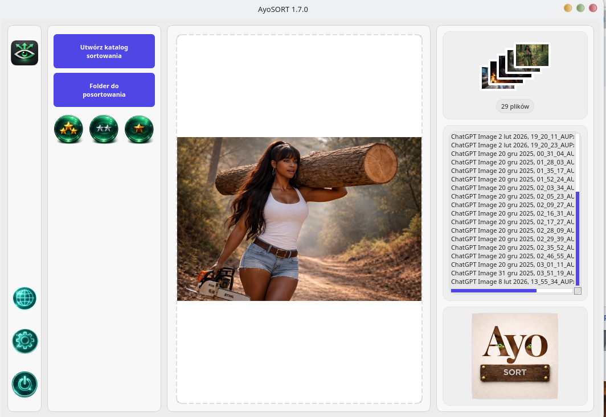
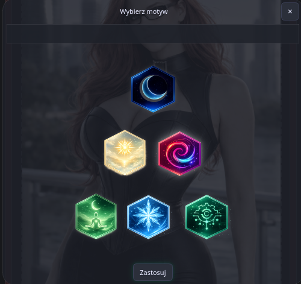
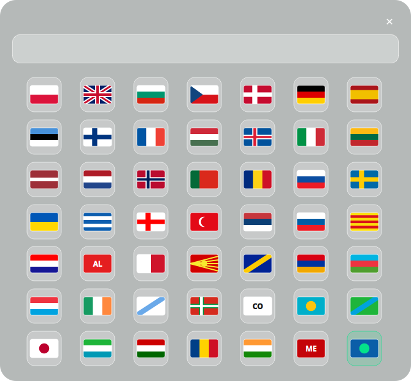
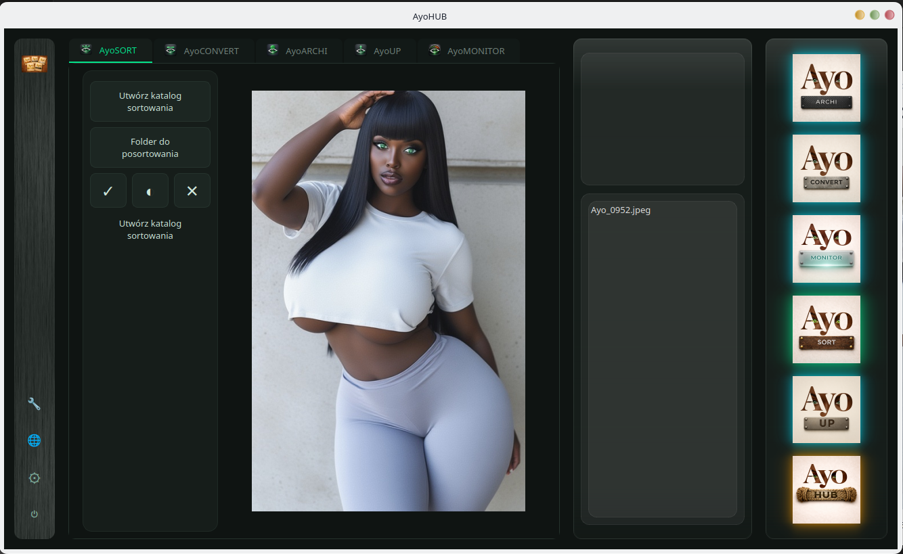

# AyoSORT 1.8.1 – Intelligent Image Sorting 🚀🖼️

[](https://github.com/Klucznik26/AyoSORT/actions/workflows/ci.yml)

AyoSORT is a fast and lightweight desktop application designed for intelligent image categorization.

Built for photographers, creators, and large dataset workflows, it provides a clean, modern interface with a lightning-fast keyboard-driven sorting system.

Part of the **Ayo Ecosystem**.

---

## 📸 AyoSORT 1.8.1 Preview

The screenshots below show the current interface with the image viewer toolbar,
sorting destination panel, image queue and all six available themes.

### Main Interface Themes

| Dark Theme | Light Theme | Creative Theme |
| :--------: | :---------: | :------------: |
|  |  |  |

| Relax Theme | Arctic Theme | System Theme |
| :---------: | :----------: | :----------: |
|  |  |  |

### Theme and Language Selection

| Theme selector | Language selector with built-in flags |
| :------------: | :------------------------------------: |
|  |  |

---

## 🆕 What’s New in 1.8.1

### Safer sessions and destinations

* A remembered but unavailable destination now blocks sorting instead of silently falling back beside the source.
* Large files are copied to hidden `.part` files, flushed, and only then published atomically under the final name.
* Category folder names are frozen for the lifetime of a session, even when the interface language changes.
* Files dropped from multiple folders are accepted after choosing one shared destination.
* Empty source folders clear stale recoverable sessions, while session-write failures are surfaced in the GUI.
* The language selector uses built-in vector flags and no longer depends on system emoji fonts.

## What’s New in 1.8.0

### Recoverable sessions and a professional image viewer

* The current queue, position, destination and complete undo history are saved atomically after every action.
* An interrupted session is restored automatically, including safe undo after restarting AyoSORT.
* The image viewer supports wheel zoom, panning, actual size, fit-to-window and full-screen viewing.
* File size, resolution and available EXIF camera/exposure information are shown with the preview.
* Two images can be opened side by side for detailed comparison; double-clicking the queue still promotes an image.

## What’s New in 1.7.1

### Safer and smoother sorting

* Existing files are never overwritten; a unique filename is selected automatically.
* Undo only removes the unchanged copy created by AyoSORT.
* Large copies run outside the GUI thread.
* Category folder names are validated and kept inside the `SORT` directory.

## What’s New in 1.7.0

### 🎨 Redesigned "Ayo Dark" Theme & UI Enhancements

* **Deep Emerald Aesthetics:** Fully redesigned dark interface with black-green tones and neon emerald accents (`#04E38A`)
* **Interactive Sidebar Icons:** High-quality graphical icons with alpha-cropping and hover glow effects
* **3D Flip Animations:** Smooth `QPropertyAnimation` transitions for interactive elements
* **Glassmorphism Dialogs:** Semi-transparent UI panels using RGBA styling
* **Dynamic Preview System:** Clicking files updates the central preview instantly

---

### 🌍 Massive Localization (i18n) Overhaul

* **49 Languages Fully Supported:** All translations verified and unified
* **Standardized ISO Codes:** Fully compliant with ISO 639-1
* **Unified Translation Keys:** Consistent keys across all `.json` files
* **Improved Language Selector Layout:** Clean grid-based UI

---

## 🚀 Key Features

### ⚡ Lightning-fast Workflow

* **Keyboard Sorting:**
  `1` → Good
  `2` → Average
  `3` → Bad

* **Drag & Drop Support:**
  Load files or folders instantly

* **Automatic Folder Structure:**
  Creates:

  ```
  SORT/
    ├── Good
    ├── Average
    └── Bad
  ```

---

### 🧠 Modern Smart Interface

🎴 **Preview Fan System**
Dynamic queue visualization for upcoming images

🎨 **Smooth Visual Feedback**
Color-based transitions during sorting

🧠 **Intelligent UI Behavior**

* Instant preview switching
* Clean workflow continuity
* Minimal friction interaction

---

## 🎨 Themes

* Dark Theme
* Light Theme
* Relax Theme
* Creative Theme
* System Theme
* Arctic Theme

All dialogs use non-native Qt rendering for full styling and localization control.

---

## 🌍 Supported Languages (49)

|                  |                |                    |                 |
| ---------------- | -------------- | ------------------ | --------------- |
| 🇦🇱 Albanian    | 🇳🇱 Dutch     | 🇮🇪 Irish         | 🇵🇹 Portuguese |
| 🇦🇲 Armenian    | 🇬🇧 English   | 🇮🇹 Italian       | 🇷🇴 Romanian   |
| 🇦🇿 Azerbaijani | 🇪🇪 Estonian  | 🇯🇵 Japanese      | 🇷🇸 Serbian    |
| 🇪🇸 Basque      | 🇫🇮 Finnish   | 🇰🇿 Kazakh        | 🇸🇰 Slovak     |
| 🇧🇦 Bosnian     | 🇫🇷 French    | 🇱🇻 Latvian       | 🇸🇮 Slovenian  |
| 🇧🇬 Bulgarian   | 🇪🇸 Galician  | 🇱🇹 Lithuanian    | 🇪🇸 Spanish    |
| 🇦🇩 Catalan     | 🇬🇪 Georgian  | 🇱🇺 Luxembourgish | 🇰🇪 Swahili    |
| 🇫🇷 Corsican    | 🇩🇪 German    | 🇲🇰 Macedonian    | 🇸🇪 Swedish    |
| 🇭🇷 Croatian    | 🇬🇷 Greek     | 🇲🇹 Maltese       | 🇹🇷 Turkish    |
| 🇨🇿 Czech       | 🇭🇺 Hungarian | 🇳🇴 Norwegian     | 🇺🇦 Ukrainian  |
| 🇩🇰 Danish      | 🇮🇸 Icelandic | 🇵🇱 Polish        | 🇮🇳 Hindi      |
| 🇲🇪 Montenegrin | 🇲🇩 Moldovan  | 🇹🇯 Tajik         | 🇺🇿 Uzbek      |
| 🌍 Interslavic  |                |                    |                 |

---

## 🏗️ Architecture

* Modular GUI structure
* ThemeManager styling system
* Internal Qt translation layer
* Non-native Qt dialogs
* `pathlib`-based file handling
* Clean event loop design

---

## 🛠 Technology

* Python 3.10+
* PySide6 (Qt for Python)
* Developed on Linux (Fedora / openSUSE)
* GitHub Actions CI with Ruff and pytest on Python 3.10 and 3.12

---

## 🌌 Ayo Ecosystem

* [**AyoARCH**](https://github.com/Klucznik26/AyoARCHI) – ZIP image viewer
* [**AyoCONVERT**](https://github.com/Klucznik26/AyoCONVERT) – file conversion tool
* [**AyoSORT**](https://github.com/Klucznik26/AyoSORT) – intelligent image categorization
* [**AyoMONITOR**](https://github.com/Klucznik26/AyoMONITOR) – system monitoring tool
* **AyoHUB** *(Coming Soon)* – a unified interface connecting all Ayo apps

<br>

More projects:
👉 https://klucznik26.github.io/AyoWWW/

---

## 📥 Installation

### 1️⃣ Clone repository

```bash
git clone https://github.com/Klucznik26/AyoSORT.git
cd AyoSORT
```

### 2️⃣ Install dependencies

```bash
python -m pip install -r requirements.txt
```

### 3️⃣ Run application

```bash
python AyoSort.py
```

### Build a clean release archive

```bash
python tools/build_release.py
```

The archive is created in `dist/` without Git metadata, tests, Python caches, Ruff caches, or previous build artifacts.

---

## License

Copyright (C) 2026 Marek Zubrzycki (Klucznik MZ)

AyoSORT is licensed under the **GNU General Public License v3.0 only**
(`GPL-3.0-only`). See [LICENSE](LICENSE) for the full license text.

---

👉 "Start sorting your images instantly"
👉 "Fast workflow, zero friction"
