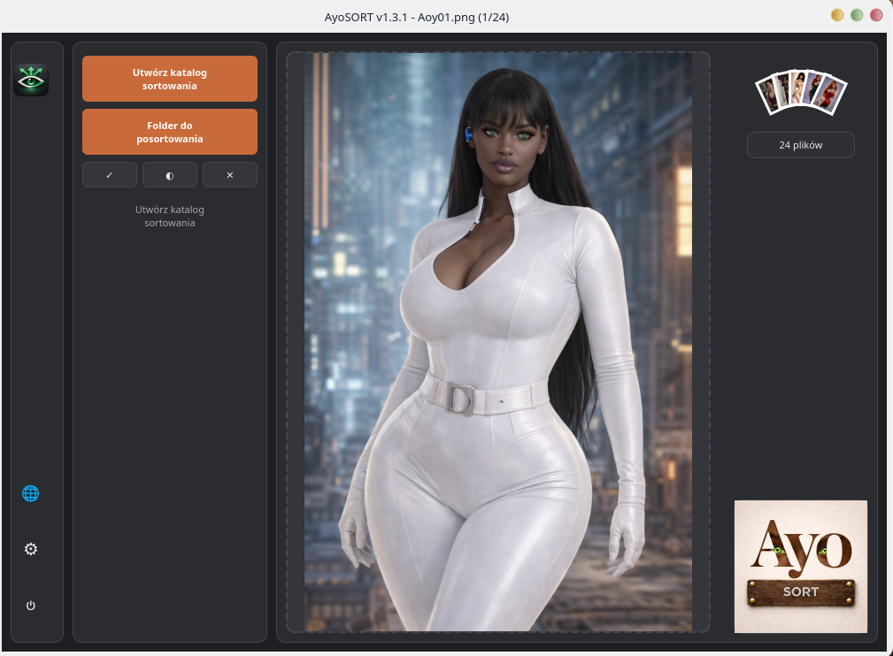
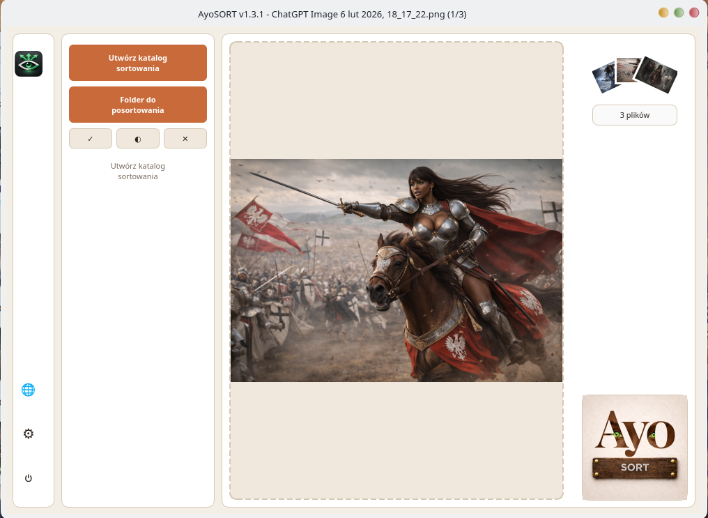
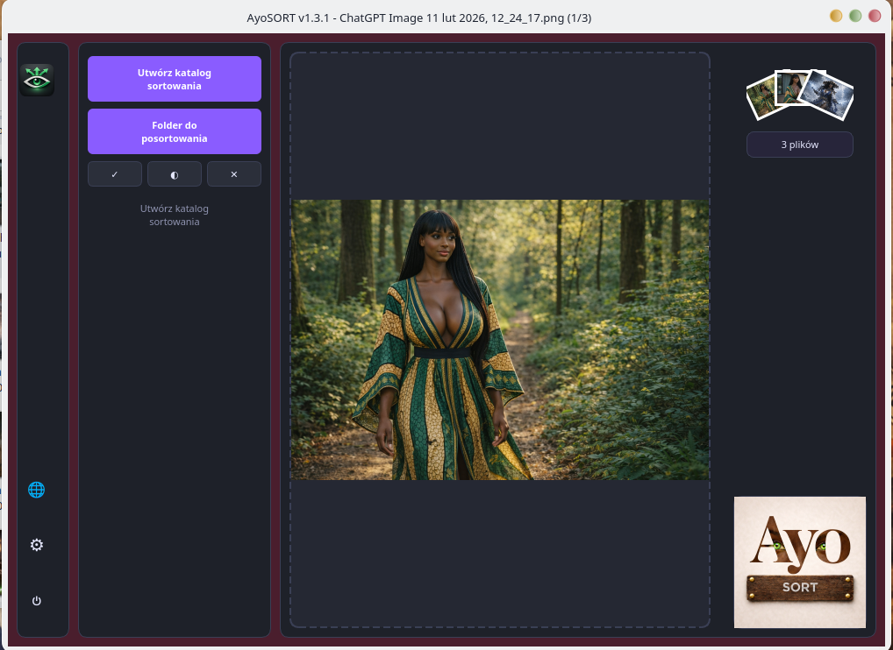
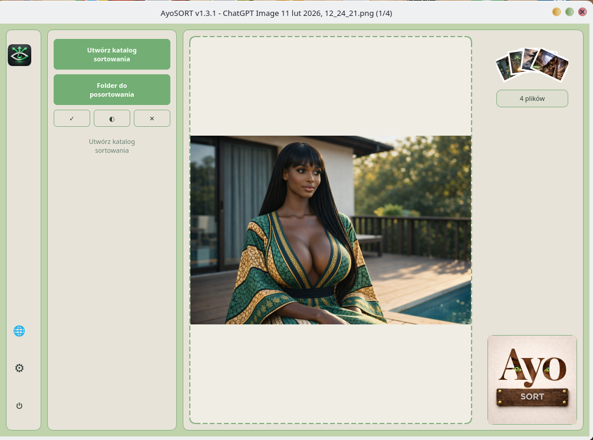
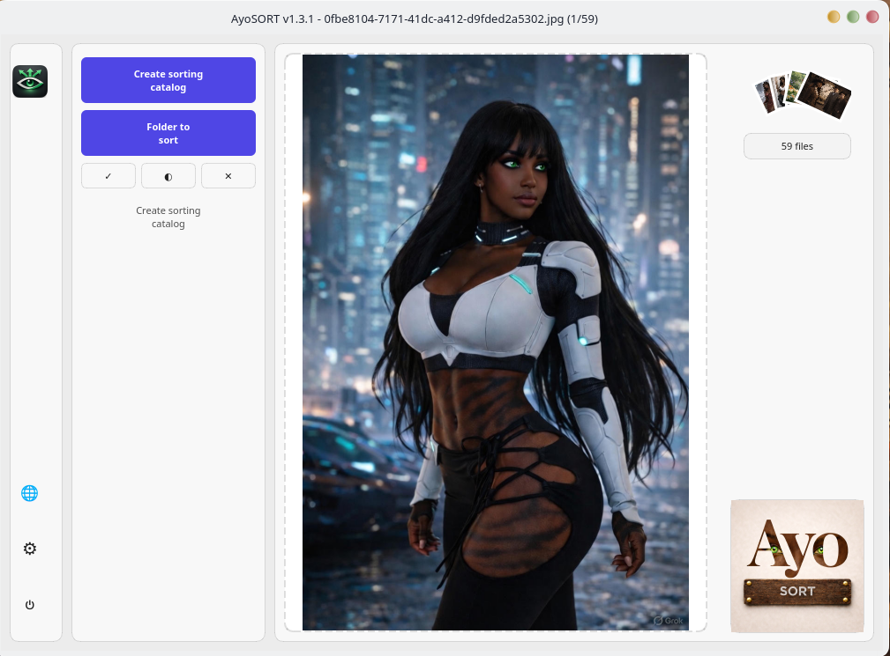
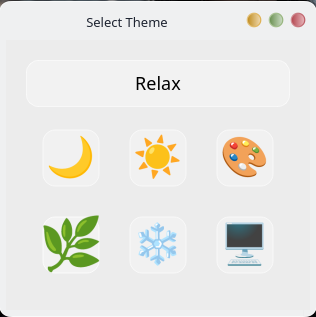
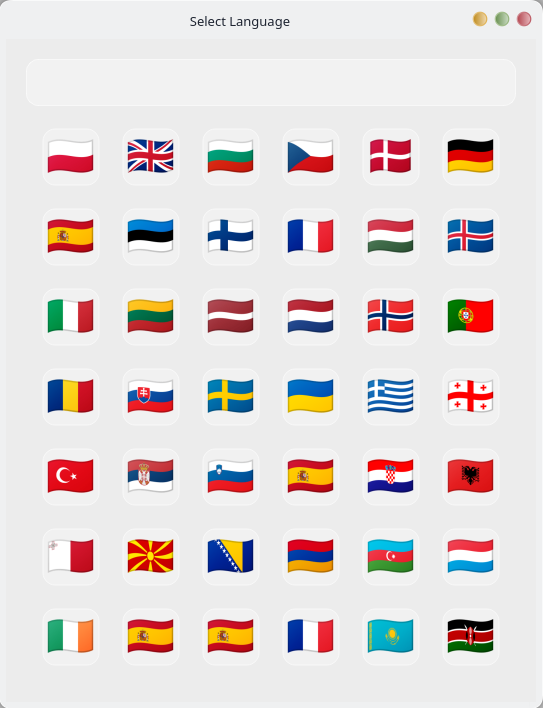

# AyoSORT 1.3.1 - Intelligent Image Sorting


**AyoSORT** is a tool created out of a passion for order and technology. The application allows for fast and intuitive categorization of image files, offering a modern graphical interface built using Python and Qt.

## 📸 Program Preview
| [Dark Theme](screenshots/main_view_dark.png) | [Light Theme](screenshots/main_view_light.png) | [Creative Theme](screenshots/main_view_creative.png) | [Relax Theme](screenshots/main_view_relax.png) | [System Theme](screenshots/main_view_system.png) |
|:---:|:---:|:---:|:---:|:---:|
| [](screenshots/main_view_dark.png) | [](screenshots/main_view_light.png) | [](screenshots/main_view_creative.png) | [](screenshots/main_view_relax.png) | [](screenshots/main_view_system.png) |

### 🌐 Personalization & Localization
Manage your photos in your preferred style and language:
| Theme Selection | Language Selection |
|:---:|:---:|
| [](screenshots/theme_selection_menu.png) | [](screenshots/language_selection_menu.png) |

## 🚀 Features
* **Intuitive Management**: Quickly create sorting directories directly from the application.
* **Multi-language Support**: Full support for various alphabets and regions.
* **Personalization**: Support for advanced QSS themes (Dark, Light, System, Creative, Relax).
* **User-Friendly Interface**: Minimalist design optimized for user experience (UX).
* **Visual Identity**: Dedicated application icon included in the `assets` directory.

## 🌐 Supported Languages
AyoMONITOR currently supports 42 interface languages:

| | | |
|---|---|---|
| 🇵🇱 Polish | 🇬🇧 English | 🇧🇬 Bulgarian |
| 🇨🇿 Czech | 🇩🇰 Danish | 🇩🇪 German |
| 🇪🇸 Spanish | 🇪🇪 Estonian | 🇫🇮 Finnish |
| 🇫🇷 French | 🇭🇺 Hungarian | 🇮🇸 Icelandic |
| 🇮🇹 Italian | 🇱🇹 Lithuanian | 🇱🇻 Latvian |
| 🇳🇱 Dutch | 🇳🇴 Norwegian | 🇵🇹 Portuguese |
| 🇷🇴 Romanian | 🇸🇰 Slovak | 🇸🇪 Swedish |
| 🇺🇦 Ukrainian | 🇬🇷 Greek | 🇬🇪 Georgian |
| 🇹🇷 Turkish | 🇷🇸 Serbian | 🇸🇮 Slovenian |
| 🇪🇸 Catalan | 🇭🇷 Croatian | 🇦🇱 Albanian |
| 🇲🇹 Maltese | 🇲🇰 Macedonian | 🇧🇦 Bosnian |
| 🇦🇲 Armenian | 🇦🇿 Azerbaijani | 🇱🇺 Luxembourgish |
| 🇮🇪 Irish | 🇰🇿 Kazakh | 🇪🇸 Galician |
| 🇪🇸 Basque | 🇫🇷 Corsican | 🇰🇪 Swahili |

## 🛠️ Technology
The application is designed for performance and seamless integration with the desktop environment:
* **Language**: Python (the author's preferred language).
* **GUI**: PyQt / PySide (utilizing QSS stylesheets for full visual control).
* **Environment**: Developed on **Fedora** with **KDE Plasma** using **ASUS TUF Gaming** hardware.

## 📦 Ayo Ecosystemgit add README.md
git rebase --continue

AyoSORT is part of a broader family of tools supporting daily workflows:
* **[Ayo-UP](https://github.com/Klucznik26/Ayo-UP)**: A dedicated tool for efficient file uploading and updates.
* **[AyoCONVERT](https://github.com/Klucznik26/AyoCONVERT)**: A convenient file converter focusing on data quality.
* **[AyoARCHI](https://github.com/Klucznik26/AyoARCH)**: A solution for secure and organized resource archiving.
* **[AyoMONITOR](https://github.com/Klucznik26/AyoARCHI)**:A lightweight system hardware monitor for Linux.

Full information about the projects can be found on the official website: **[AyoWWW](https://klucznik26.github.io/AyoWWW/)**.

## 📥 Installation
1. Clone the repository:
   ```bash
   git clone [https://github.com/Klucznik26/AyoSORT.git](https://github.com/Klucznik26/AyoSORT.git)
